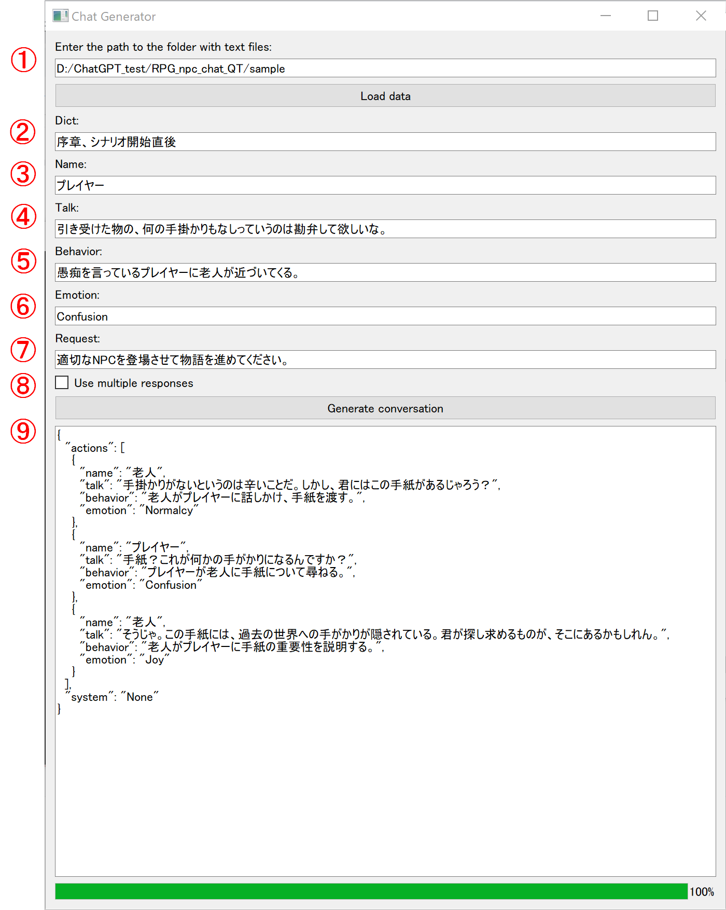

# Langchain LLM Sample

Langchain LLM Sample is a sample application that demonstrates the usage of the Langchain library to generate realistic and engaging dialogues with non-player characters (NPCs) in role-playing games. This project is powered by OpenAI's GPT API and uses a custom implementation to generate the conversations.

## Installation

1. Clone this repository:

git clone https://github.com/MayaEnomoto/LangchainLLMSample.git
 
 

2. Install the required dependencies:

pip install -r requirements.txt

## Usage

0. Set Open AI API:

Set your Open AI API-key in config.py.
 
 

1. Run the application:

python app_async.py

(1)Enter the path to the folder with text files:
Specify various settings in text files and store them in FAISS.

(2)Dict:
Enter topics and additional settings as needed.

(3)Name:
Enter the character for the conversation or action. The conversation and action can be left blank if necessary.

(4)Talk:
Enter the conversation.

(5)Behavior:
Enter the action.

(6)Emotion:
Enter the emotion of the conversation or action.

(7)Request:
Enter the content you want to request from GPT.

(8)Use multiple responses:
Change the response check from GPT from retries to multiple responses.

(9)Generate conversation:
The response from GPT will be displayed.
 
 

2. Follow the instructions in the user interface to generate conversations with NPCs.

## License

This project is licensed under the [MIT License](LICENSE).

